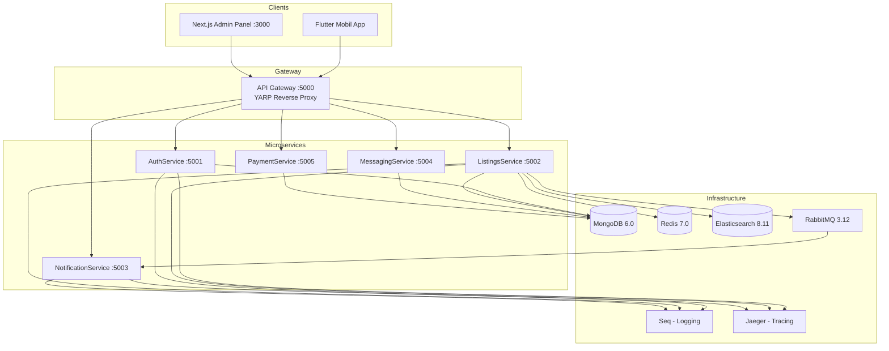

# 📋 EsaEmlak — Kapsamlı Uygulama Raporu

> **Tarih:** 3 Nisan 2026 · **Versiyon:** 1.0.0 · **Lisans:** MIT

---

## 1. Genel Bakış

**EsaEmlak**, Türkiye emlak pazarına yönelik, Sahibinden.com benzeri gelişmiş filtreleme ve arama yeteneklerine sahip, **production-ready** bir gayrimenkul ilanları platformudur. Platform üç ana bileşenden oluşur:

| Bileşen | Teknoloji | Açıklama |
|---------|-----------|----------|
| **Backend** | .NET 9 Microservices | 6 bağımsız servis + API Gateway |
| **Mobil Uygulama** | Flutter 3.x (Dart ^3.8) | Android/iOS cross-platform |
| **Admin Panel** | Next.js 16 + React 19 | Web tabanlı yönetim arayüzü |

**Canlı API:** `https://esaemlak-api.fly.dev` (Fly.io üzerinde deploy edilmiş)

---

## 2. Mimari Yapı



### API Gateway Routing Tablosu

| Route | Hedef Cluster | Port |
|-------|---------------|------|
| `/api/auth/**` | auth-cluster | 5001 |
| `/api/listings/**` | listings-cluster | 5002 |
| `/api/search/**` | listings-cluster | 5002 |
| `/api/favorites/**` | listings-cluster | 5002 |
| `/api/locations/**` | listings-cluster | 5002 |
| `/api/agencies/**` | listings-cluster | 5002 |
| `/hubs/notifications/**` | notification-cluster | 5006 |
| `/hubs/chat/**` | messaging-cluster | 5004 |
| `/api/payments/**` | payment-cluster | 5005 |

---

## 3. Backend Microservices Detayı

### 3.1 AuthService (Port 5001)

JWT tabanlı kimlik doğrulama ve kullanıcı yönetimi servisi.

**API Endpoints:**

| Endpoint | Method | Auth | Açıklama |
|----------|--------|------|----------|
| `/api/auth/register` | POST | ❌ | Yeni kullanıcı kaydı |
| `/api/auth/login` | POST | ❌ | Giriş (JWT token) |
| `/api/auth/me` | GET | ✅ | Mevcut kullanıcı bilgisi |
| `/api/auth/logout` | POST | ✅ | Çıkış |
| `/api/auth/refresh-token` | POST | ❌ | Token yenileme |
| `/api/auth/forgot-password` | POST | ❌ | Şifre sıfırlama talebi |
| `/api/auth/reset-password` | POST | ❌ | Şifre sıfırlama |
| `/api/auth/change-password` | POST | ✅ | Şifre değiştirme |
| `/api/auth/profile` | PUT | ✅ | Profil güncelleme |

**User Modeli (MongoDB):**

| Alan | Tip | Açıklama |
|------|-----|----------|
| `ad`, `soyad` | string | İsim-soyisim |
| `email`, `telefon` | string | İletişim |
| `sifre` | string | BCrypt hash |
| `rol` | string | `kullanici`, `emlakci`, `admin` |
| `yetkiBelgesiNo` | string? | Emlakçı yetki belgesi |
| `sirketAdi` | string? | Şirket adı |
| `onayli`, `banli` | bool | Onay/Ban durumu |
| `emailOnayli`, `telefonOnayli` | bool | Doğrulama durumları |
| `twoFactorEnabled` | bool | 2FA |
| `pushToken` | string? | Push bildirim token |
| `refreshToken`, `refreshTokenExpiry` | string/date | Refresh token |
| `passwordResetToken`, `passwordResetExpiry` | string/date | Şifre sıfırlama |

---

### 3.2 ListingsService (Port 5002)

İlan CRUD, Elasticsearch arama, Redis cache ve fiyat takibi.

**API Endpoints:**

| Endpoint | Method | Açıklama |
|----------|--------|----------|
| `/api/listings` | GET | İlanları listele (paginated) |
| `/api/listings` | POST | Yeni ilan oluştur |
| `/api/listings/{id}` | GET | İlan detayı (görüntülenme sayacı artırılır) |
| `/api/listings/{id}` | PUT | İlan güncelle |
| `/api/listings/{id}` | DELETE | İlan sil |
| `/api/listings/my-listings` | GET | Kullanıcının ilanları |
| `/api/listings/price-drops` | GET | Fiyatı düşen ilanlar (Redis cached, 15dk TTL) |
| `/api/listings/showcase` | GET | Vitrin ilanları (5 farklı bölüm) |
| `/api/listings/upload` | POST | Fotoğraf yükleme (multipart) |
| `/api/search` | GET/POST | Elasticsearch gelişmiş arama |
| `/api/favorites/{id}` | POST/DELETE | Favori ekle/kaldır |
| `/api/favorites/{id}/check` | GET | Favori kontrolü |
| `/api/favorites` | GET | Favori listesi |

**Listing Modeli — 50+ Alan:**

````carousel
**Temel Bilgiler:**
- `Baslik`, `Aciklama`, `EmlakciId`
- `Kategori`: Konut, IsYeri, Arsa
- `AltKategori`: Daire, Villa, Rezidans, Mustakil, Dukkan, Ofis
- `IslemTipi`: satilik, kiralik
- `Fiyat` (decimal)
<!-- slide -->
**Fiziksel Özellikler:**
- `BrutMetrekare`, `NetMetrekare`
- `OdaSayisi`: 1+0 ... 6+
- `BinaYasi`: 0, 1-5, 5-10, 10-15, 15-20, 20+
- `BanyoSayisi`, `BulunduguKat`, `KatSayisi`
- `IsitmaTipi`: Kombi, Merkezi, Soba, Klima, Dogalgaz
<!-- slide -->
**Donanım & Özellikler:**
- Boolean: `Esyali`, `Balkon`, `Asansor`, `Otopark`, `SiteIcerisinde`, `Havuz`, `Guvenlik`
- Listeler: `Manzara`, `Cephe`, `Ulasim`, `Muhit`, `IcOzellikler`, `DisOzellikler`, `EngelliyeUygunluk`
<!-- slide -->
**İş Yeri / Arsa Özel Alanlar:**
- İş Yeri: `GirisYuksekligi`, `ZeminEtudu`, `Devren`, `Kiracili`, `YapininDurumu`
- Arsa: `AdaParsel`, `Gabari`, `KaksEmsal`, `KatKarsiligi`, `ImarDurumu`
<!-- slide -->
**Konum & Durum:**
- `Il`, `Ilce`, `Mahalle`, `Adres`
- `Konum` (GeoJSON Point: `[longitude, latitude]`)
- `Aktif`, `Onaylandi`, `GoruntulemeSayisi`
- `AcilSatilik`, `FiyatiDustu`, `KrediyeUygun`, `Takasli`
- `TapuDurumu`, `Kimden`, `Fotograflar[]`, `VideoUrl`
````

**Showcase (Vitrin) Bölümleri:**

| Bölüm | Açıklama |
|-------|----------|
| `gununFirsatlari` | Günün fırsat ilanları |
| `acilSatiliklar` | Acil satılık ilanlar |
| `sonEklenenler` | Son eklenen ilanlar |
| `cokGoruntulenler` | Popüler ilanlar |
| `fiyatiDusenler` | Fiyatı düşen ilanlar |

---

### 3.3 NotificationService (Port 5003/5006)

RabbitMQ event consumer + SignalR WebSocket hub.

- **SignalR Hub:** `/hubs/notifications` (JWT auth via query string)
- **Consumer:** `RabbitMQConsumerService` (BackgroundService)
- **Handler:** `NotificationHandler` — event'leri işleyip SignalR üzerinden bildirim gönderir

---

### 3.4 MessagingService (Port 5004)

Kullanıcılar arası gerçek zamanlı mesajlaşma.

- **SignalR Hub:** `/hubs/chat`
- **Veritabanı:** MongoDB (`esaemlak_v2`)
- **Özellikler:** Chat hub, mesaj geçmişi, gerçek zamanlı iletim

---

### 3.5 PaymentService (Port 5005)

Ödeme işlemleri ve abonelik yönetimi.

- **Veritabanı:** MongoDB
- **Event Bus:** RabbitMQ ile ödeme olayları

---

### 3.6 Shared.Events

Servisler arası paylaşılan event contract'ları:

| Event | Routing Key | Payload |
|-------|-------------|---------|
| `ListingCreatedEvent` | `listings.listing.created` | ListingId, UserId, Baslik, Fiyat, Il, Ilce, Konum |
| `ListingUpdatedEvent` | `listings.listing.updated` | ListingId, OldFiyat, NewFiyat |
| `ListingDeletedEvent` | `listings.listing.deleted` | ListingId, UserId |
| `ListingPriceChangedEvent` | `listings.listing.pricechanged` | ListingId, OldPrice, NewPrice, ChangePercentage |
| `ListingViewedEvent` | `listings.listing.viewed` | ListingId, ViewerIpAddress |

---

## 4. Flutter Mobil Uygulama

### 4.1 Teknik Özellikler

| Özellik | Detay |
|---------|-------|
| **SDK** | Dart ^3.8.0 |
| **State Management** | Provider 6.x |
| **Routing** | MaterialApp + onGenerateRoute |
| **Tema** | Material 3, Light/Dark mode desteği |
| **HTTP Client** | `http` package |
| **Harita** | `flutter_map` + `latlong2` (OpenStreetMap) |
| **Realtime** | `signalr_netcore` |
| **Storage** | `shared_preferences` + `flutter_secure_storage` |
| **Fonts** | `google_fonts` |
| **Caching** | `cached_network_image` |

### 4.2 Ekranlar (18 Sayfa)

| Ekran | Dosya | Özellikler |
|-------|-------|------------|
| **Splash** | `splash_screen.dart` | Uygulama açılışı |
| **Login** | `login_screen.dart` | E-posta/şifre girişi |
| **Register** | `register_screen.dart` | Yeni kullanıcı kaydı |
| **Home** | `home_screen.dart` | Vitrin bölümleri, arama, bildirim badge |
| **Listing Detail** | `listing_detail_screen.dart` | İlan detayı, görseller, harita |
| **Filter** | `filter_screen.dart` | 40+ gelişmiş filtre (Sahibinden tarzı) |
| **Map Search** | `map_search_screen.dart` | Harita üzerinde geo-bounding arama |
| **Create Listing (Wizard)** | `wizard_*.dart` (6 adım) | Kategori → Alt Kategori → İşlem Tipi → Detay → Adres → Harita |
| **My Listings** | `my_listings_screen.dart` | Kullanıcının ilanlarını yönetme |
| **Favorites** | `favorites_screen.dart` | Favori ilanlar |
| **Profile** | `profile_screen.dart` | Kullanıcı profili |
| **Edit Profile** | `edit_profile_screen.dart` | Profil düzenleme |
| **Messages** | `messages_screen.dart` | Mesaj listesi |
| **Chat** | `chat_screen.dart` | SignalR ile gerçek zamanlı sohbet |
| **Comparison** | `comparison_screen.dart` | İlan karşılaştırma |
| **Store Page** | `store_page_screen.dart` | Emlakçı mağaza sayfası |
| **Settings** | `settings_screen.dart` | Uygulama ayarları |
| **Maintenance** | `maintenance_screen.dart` | Bakım modu ekranı |

### 4.3 Provider'lar (7 Adet)

| Provider | Sorumluluk |
|----------|------------|
| `AuthProvider` | JWT token yönetimi, oturum durumu |
| `NotificationProvider` | SignalR bağlantısı, toast bildirimler |
| `ServiceStatusProvider` | API sağlık kontrolü, bakım modu |
| `ThemeProvider` | Light/Dark tema geçişi |
| `MessagingService` | Mesajlaşma SignalR bağlantısı |
| `ComparisonProvider` | İlan karşılaştırma sepeti |
| `DraftListingProvider` | Wizard adımları arası taslak ilan verisi |

### 4.4 Widgetlar (9 Adet)

| Widget | Açıklama |
|--------|----------|
| `ListingCard` | İlan kartı (grid/liste için) |
| `HeroSlider` | Anasayfa hero slider |
| `PriceDropsSlider` | Fiyatı düşen ilanlar karuseli |
| `CategoryCards` | Kategori kartları |
| `MortgageCalculator` | Kredi hesaplama |
| `NotificationToast` | Bildirim toast mesajları |
| `EmptyState` | Boş durumlar |
| `ListingActions` | İlan aksiyon butonları |
| `PriceTagMarker` | Harita fiyat marker'ı |

### 4.5 Gelişmiş Arama Filtreleri (40+ Parametre)

Sahibinden.com düzeyinde arama yetenekleri:
- **Temel:** Metin araması, kategori, alt kategori, işlem tipi
- **Konum:** İl, ilçe, geo-bounding box (harita araması)
- **Fiyat:** Min/max fiyat aralığı
- **Fiziksel:** Metrekare aralığı, oda sayısı, bina yaşı, kat sayısı, banyo sayısı
- **Özellikler:** Eşyalı, balkon, asansör, otopark, site içi, havuz, güvenlik
- **Kategoriye özel:** Mutfak tipi, konut tipi, kullanım durumu, giriş yüksekliği
- **Listeler:** Manzara, cephe, ulaşım, muhit, iç/dış özellikler, engelliye uygunluk
- **Promosyon:** Acil satılık, fiyatı düşmüş, video var
- **Sıralama:** Fiyat, tarih, görüntülenme sıralama seçenekleri

---

## 5. Admin Panel (Next.js)

### 5.1 Teknik Yığın

| Teknoloji | Versiyon |
|-----------|----------|
| Next.js | 16.1.6 |
| React | 19.2.3 |
| TypeScript | ^5 |
| TailwindCSS | ^4 |
| Recharts | ^3.7.0 (grafikler) |
| Lucide React | ^0.575.0 (ikonlar) |

### 5.2 Sayfalar

| Sayfa | Yol | Açıklama |
|-------|-----|----------|
| Login | `/login` | Admin girişi |
| Dashboard | `/(admin)/dashboard` | Genel istatistikler ve grafikler |
| Listings | `/(admin)/listings` | İlan yönetimi |
| Pending | `/(admin)/listings/pending` | Onay bekleyen ilanlar |
| Users | `/(admin)/users` | Kullanıcı yönetimi |
| Messages | `/(admin)/messages` | Mesaj yönetimi |
| Payments | `/(admin)/payments` | Ödeme yönetimi |
| Settings | `/(admin)/settings` | Sistem ayarları |

---

## 6. Altyapı & DevOps

### 6.1 Docker Compose (12 Servis)

```
┌─────────────────────────────────────────────────────────┐
│                    Docker Network                        │
│                   (emlaktan-network)                     │
├──────────────────────┬──────────────────────────────────┤
│  Uygulama Servisleri │  Altyapı Servisleri              │
│  ─────────────────── │  ────────────────────────────    │
│  • admin-panel       │  • MongoDB 6.0      (:27017)    │
│  • api-gateway       │  • RabbitMQ 3.12    (:5672/     │
│  • auth-service      │                      15672)     │
│  • listings-service  │  • Elasticsearch 8.11 (:9200)   │
│  • notification-svc  │  • Seq (Logging)    (:5341)     │
│  • messaging-service │  • Jaeger (Tracing) (:16686)    │
│  • payment-service   │                                  │
└──────────────────────┴──────────────────────────────────┘
```

### 6.2 Resilience Paternleri (Polly)

| Pattern | Yapılandırma |
|---------|--------------|
| **Retry** | 3 deneme, exponential backoff (2s → 4s → 8s) |
| **Circuit Breaker** | 5 başarısız sonra açılır, 30s süre |

### 6.3 Rate Limiting

| Kural | Limit | Süre |
|-------|-------|------|
| Global | 10 istek | 1 saniye |
| Login | 10 istek | 1 dakika |

### 6.4 Gözlemlenebilirlik (Observability)

| Araç | URL | Amaç |
|------|-----|------|
| Health UI | `:5000/health-ui` | Servis sağlık durumu |
| Seq | `:5341` | Merkezi log yönetimi (Serilog) |
| Jaeger | `:16686` | Dağıtık izleme (tracing) |

### 6.5 Caching Stratejisi

| Cache Key | Açıklama | TTL |
|-----------|----------|-----|
| `EsaEmlak:price_drops:10` | Top 10 indirimli ilan | 15 dk |
| `EsaEmlak:price_drops:20` | Top 20 indirimli ilan | 15 dk |

```
GET /api/listings/price-drops → Redis HIT? → Return
                               → Redis MISS? → Elasticsearch Query → Redis'e Yaz → Return
```

---

## 7. Veritabanı Yapısı

**MongoDB Veritabanı:** `esaemlak_v2`

| Koleksiyon | Servis | Açıklama |
|------------|--------|----------|
| `users` | AuthService | Kullanıcı verileri |
| `ilans` | ListingsService | İlan verileri |
| `favorites` | ListingsService | Favoriler |
| `agencies` | ListingsService | Emlak ofisleri |
| `messages` | MessagingService | Mesajlar |
| `payments` | PaymentService | Ödeme kayıtları |

---

## 8. Proje Dosya Yapısı & İstatistikler

```
esaemlak/
├── backend/                  # .NET 9 Backend
│   ├── ApiGateway/           # YARP proxy, rate limiting, health
│   ├── AuthService/          # JWT auth, user CRUD
│   │   ├── Controllers/      # AuthController (9 endpoint)
│   │   ├── DTOs/             # Request/Response modelleri
│   │   ├── Models/           # User, Configuration
│   │   ├── Repositories/    # MongoDB CRUD
│   │   └── Services/        # İş mantığı
│   ├── ListingsService/      # İlan CRUD, arama, cache
│   │   ├── Controllers/      
│   │   ├── DTOs/             
│   │   ├── Elasticsearch/   # Search/Index servisi
│   │   ├── Enums/           
│   │   ├── Infrastructure/  # Polly policies
│   │   ├── Models/          # Listing (50+ alan), Favorite, Agency
│   │   ├── Repositories/   
│   │   └── Services/       # ListingService, CacheService, EventBus
│   ├── MessagingService/    # SignalR chat
│   ├── NotificationService/ # Event handler + SignalR hub
│   ├── PaymentService/      # Ödemeler
│   └── Shared.Events/      # Event kontratları (5 event)
│
├── flutter_app/             # Flutter Mobil Uygulama
│   └── lib/
│       ├── data/            # Kategori verileri, Türkiye konumları
│       ├── models/          # User, Listing, SearchFilter (657 satır)
│       ├── providers/       # 7 provider
│       ├── screens/         # 18 ekran (6 wizard adımı dahil)
│       ├── services/        # 5 servis (API, location, messaging, notification, storage)
│       ├── theme/           # AppTheme (light/dark)
│       └── widgets/         # 9 widget
│
├── admin-panel/             # Next.js Admin Panel
│   ├── app/                 # 7 sayfa + API proxy
│   ├── components/          # Sidebar
│   └── lib/                 # Utility'ler
│
├── docker-compose.yml       # 12 servis orkestrasyonu
├── ARCHITECTURE.md          # Mimari dokümantasyonu
├── BASLAT_BACKEND.bat       # Backend başlatma scripti
└── turkiye-api-main/        # Türkiye İl/İlçe/Mahalle verileri
```

---

## 9. Deployment

| Hedef | Teknoloji | Detay |
|-------|-----------|-------|
| **Backend API** | Fly.io | `esaemlak-api.fly.dev` |
| **Konteynerizasyon** | Docker | Her servis için Dockerfile |
| **Orkestrasyon** | Docker Compose | Yerel geliştirme ortamı |
| **CI/CD** | Fly.io deploy | `fly.toml` + `Dockerfile.fly` + `supervisord.conf` |

---

## 10. Özet Sayılar

| Metrik | Değer |
|--------|-------|
| Backend servisleri | 6 microservice + 1 gateway |
| Toplam API endpoint | ~25+ |
| Listing modeli alan sayısı | 50+ |
| Flutter ekran sayısı | 18 |
| Flutter provider sayısı | 7 |
| Flutter widget sayısı | 9+ |
| Arama filtre parametresi | 40+ |
| Docker servis sayısı | 12 |
| Event tipi | 5 |
| Admin panel sayfası | 7 |
| Veritabanı koleksiyonu | 6+ |
